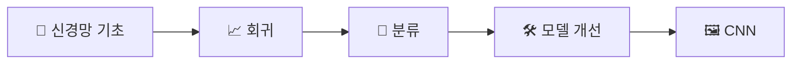

<div align="center">

# 📘 Furiosa TensorFlow · Keras Study

**TensorFlow/Keras 기반 딥러닝 수업 필기와 실습 기록 아카이브**

<br>

[](https://www.python.org/)
[](https://www.tensorflow.org/)
<br>


<br>

**[📚 학습 필기](#-학습-필기-study-notes)** &nbsp; | &nbsp; **[💻 실습 구성](#-실습-구성-practice-structure)** &nbsp; | &nbsp; **[✍️ Velog 시리즈](https://velog.io/@wordi/series/AI-%EC%97%94%EC%A7%80%EB%8B%88%EC%96%B4%EB%A7%81-%ED%95%99%EC%8A%B5%EB%85%B8%ED%8A%B8)**

</div>

<br><br>

## 📌 개요 (Overview)

> [!NOTE]
> **Furiosa AI Agent 과정**에서 학습한 TensorFlow/Keras 내용을 정리한 저장소입니다.  
> 수업 필기와 실습 코드를 날짜와 주제에 따라 체계적으로 기록하고 있습니다.

### 🎯 주요 학습 범위

| 구분 | 핵심 키워드 |
| :--- | :--- |
| **신경망 기초** | `Dense Layer`, `Weight`, `Bias`, `Forward Propagation`, `Backpropagation` |
| **문제 유형** | `Regression`, `Binary Classification`, `Multi-class Classification` |
| **데이터 처리** | `Train/Validation/Test Split`, `Scaling`, `Input Shape` |
| **모델 학습** | `Loss Function`, `Optimizer`, `Batch`, `Epoch` |
| **평가 지표** | `R²`, `RMSE`, `Accuracy`, `ROC-AUC` |
| **일반화** | `Overfitting`, `EarlyStopping`, `Dropout` |
| **모델 관리** | `Model Save/Load`, `Weight Save/Load`, `ModelCheckpoint` |
| **모델 구조** | `Sequential API`, `Functional API`, `CNN` |

<br>

### 🌊 학습 흐름



<br><br>

## 📚 학습 필기 (Study Notes)

> PC와 모바일 모두에서 읽기 쉽도록 일차별 핵심 내용과 링크를 정리했습니다.

| Day | Topic | Details & Links |
| :---: | :--- | :--- |
| **1** | **신경망 기초** | 개발 환경, Batch, 가중치와 편향, 역전파, Loss<br>🔗 [📘 필기 보기](./keras/1일차%20필기.md) |
| **2** | **텐서와 행렬** | 스칼라·벡터·행렬·텐서, 행렬곱, Shape, Sequential 모델<br>🔗 [📘 필기 보기](./keras/2일차%20필기.md) |
| **3** | **데이터 분리 & MSE** | Train/Test 분리, `train_test_split`, MSE<br>🔗 [📘 필기 보기](./keras/3일차%20필기.md) |
| **4** | **회귀와 분류** | 데이터 중요성, 회귀/분류 전처리<br>🔗 [📘 필기](./keras/4일차%20필기.md) · [✍️ Velog](https://velog.io/@wordi/MSE-RMSE-RMSLE-R2%EC%9D%98-%EA%B4%80%EA%B3%84) |
| **5** | **Dense와 ReLU** | Dense Layer, ReLU, Hidden/Output Layer<br>🔗 [📘 필기](./keras/5일차%20필기-%20ReLU.md) · [✍️ Velog](https://velog.io/@wordi/%EA%B7%80-%EC%B4%88%ED%8F%89%EB%A9%B4-%EB%89%B4%EB%9F%B0-ReLU-%EC%88%9C%EC%A0%84%ED%8C%8C%EC%99%80-%EC%97%AD%EC%A0%84%ED%8C%8C) |
| **6** | **Validation & EarlyStopping** | 과적합, History 시각화, EarlyStopping<br>🔗 [📘 필기 보기](./keras/6일차%20필기.md) |
| **7** | **과적합과 이진 분류** | 학습 시간 측정, 과적합 방지, 이진 분류<br>🔗 [📘 필기](./keras/7일차%20필기.md) · [✍️ Velog](https://velog.io/@wordi/%EB%B6%84%EB%A5%98-%EB%AA%A8%EB%8D%B8%EC%97%90%EC%84%9C-loss-%ED%95%A8%EC%88%98-%EC%84%B1%EB%8A%A5-%EB%B9%84%EA%B5%90-Mean-Squared-Error-VS-Cross-Entropy) |
| **8** | **문제 유형 비교** | 회귀, 이진 분류, 다중 분류 비교<br>🔗 [📘 필기 보기](./keras/8일차%20필기.md) |
| **9** | **다중 분류 & ROC-AUC** | Softmax, One-Hot Encoding, Argmax, ROC-AUC<br>🔗 [📘 필기 보기](./keras/9일차%20필기.md) |
| **10** | **Scaling과 모델 저장** | 4가지 Scaler 비교, 이상치 처리, 모델 저장<br>🔗 [📘 필기 보기](./keras/10일차%20필기.md) |
| **11** | **Functional API & Dropout** | Functional 모델 구조, Dropout, Branch, Ensemble<br>🔗 [📘 필기](./keras/11일차%20필기.md) · [✍️ Velog](https://velog.io/@wordi/Dropout%EC%9D%84-%EC%95%84%EC%A3%BC-%EC%89%BD%EA%B2%8C-%EC%9D%B4%ED%95%98%EA%B8%B0) |

<br><br>

## 🖼️ 학습 내용 예시 (Visual Note)

> [!TIP]
> **입력 Feature 수와 초평면**  
> 입력 Feature가 1개인 선형 모델은 2차원 공간의 직선으로, 2개인 선형 모델은 3차원 공간의 평면으로 표현됩니다.

<div align="center">
  <a href="https://velog.io/@wordi/%EA%B7%80-%EC%B4%88%ED%8F%89%EB%A9%B4-%EB%89%B4%EB%9F%B0-ReLU-%EC%88%9C%EC%A0%84%ED%8C%8C%EC%99%80-%EC%97%AD%EC%A0%84%ED%8C%8C">
    
  </a>
  <p><sub>ChatGPT를 활용해 제작한 학습용 이미지 · 내용 구성 및 검수: 작성자</sub></p>
</div>

*자세한 내용은 [초평면·뉴런·ReLU·순전파와 역전파](https://velog.io/@wordi/%EA%B7%80-%EC%B4%88%ED%8F%89%EB%A9%B4-%EB%89%B4%EB%9F%B0-ReLU-%EC%88%9C%EC%A0%84%ED%8C%8C%EC%99%80-%EC%97%AD%EC%A0%84%ED%8C%8C) 글에서 확인할 수 있습니다.*

<br><br>

## 💻 실습 구성 (Practice Structure)

코드 파일은 학습 흐름을 파악하기 쉽도록 번호순으로 관리합니다.

<details>
<summary><b>📂 전체 실습 파일 디렉토리 보기 (클릭)</b></summary>
<br>

| 파일 범위 | 실습 내용 |
| :--- | :--- |
| `keras01` – `keras08` | Keras 기초, Dense, Batch, 행렬, 다중 입력/출력 |
| `keras09` – `keras20` | 데이터 분리, 회귀, 평가 지표, Validation, 과적합, EarlyStopping |
| `keras21` – `keras28` | 이진·다중 분류, Input Shape, Scaling |
| `keras29` – `keras32` | 모델 저장과 불러오기, ModelCheckpoint |
| `keras33` | Dropout 적용 |
| `keras34` | Functional API 모델 구성 |
| `keras35` | GPU 실행 테스트 |
| `keras36` | CNN 구조와 MNIST 실습 |

</details>

<br><br>

## 🗂️ 데이터셋 (Datasets)

| 문제 유형 | 사용 데이터셋 |
| :---: | :--- |
| **Regression** | California Housing, Diabetes, Boston Housing, Dacon 따릉이, Kaggle Bike Sharing |
| **Binary Classification** | Breast Cancer Wisconsin, Santander Customer Transaction |
| **Multi Classification** | Iris, Wine, Covertype, Digits, MNIST |

> [!IMPORTANT]
> **데이터 경로 주의사항**  
> Dacon과 Kaggle 실습 데이터는 본 저장소에 포함되어 있지 않습니다. 코드를 실행하려면 로컬 환경의 `./_data/...` 경로에 데이터를 직접 다운로드하여 준비해야 합니다.

<br><br>

## ⚙️ 개발 환경 (Environment)

원활한 실습을 위해 아래의 라이브러리 설치가 필요합니다.

```bash
# 필수 라이브러리 설치
pip install tensorflow numpy pandas scikit-learn matplotlib
```

- **OS / Hardware**: 본인의 로컬 환경 (일부 코드는 GPU 실행 테스트 포함)
- **Framework**: TensorFlow, Keras
- **Data & Math**: NumPy, pandas, scikit-learn
- **Visualization**: Matplotlib

<br><br>

## ✍️ 관련 글 (Related Writing)

- [AI 엔지니어링 학습노트 시리즈 전체 보기](https://velog.io/@wordi/series/AI-%EC%97%94%EC%A7%80%EB%8B%88%EC%96%B4%EB%A7%81-%ED%95%99%EC%8A%B5%EB%85%B8%ED%8A%B8)
- [딥러닝을 공부하며 깨달은 프롬프트 엔지니어링의 본질](https://velog.io/@wordi/%EB%94%A5%EB%9F%AC%EB%8B%9D%EC%9D%84-%EA%B3%B5%EB%B6%80%ED%95%98%EB%A9%B0-%EA%B9%A8%EB%8B%AC%EC%9D%80-%ED%94%84%EB%A1%AC%ED%94%84%ED%8A%B8-%EC%97%94%EC%A7%80%EB%8B%88%EC%96%B4%EB%A7%81%EC%9D%98-%EB%B3%B8%EC%A7%88)

<br>
<p align="center">
  <i>Written with passion for AI Engineering.</i>
</p>
