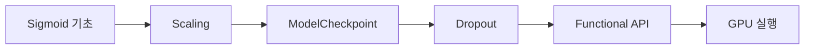

<div align="center">

# 🚀 Furiosa TensorFlow · Keras Study

### 모델을 실행하는 데서 멈추지 않고, **왜 그렇게 학습되는지** 파고드는 딥러닝 실험 기록

[](https://www.python.org/)
[](https://www.tensorflow.org/)
[](https://scikit-learn.org/)
[](https://github.com/JangDongyul123)
[]([[https://velog.io/@wordi/series](https://velog.io/@wordi/series/AI-%EC%97%94%EC%A7%80%EB%8B%88%EC%96%B4%EB%A7%81-%ED%95%99%EC%8A%B5%EB%85%B8%ED%8A%B8)])

[📚 학습 필기](#-학습-필기) · [🧪 실습 로드맵](#-실습-로드맵) · [🔥 핵심 실험](#-핵심-실험) · [✍️ 기술 블로그](https://velog.io/@wordi/series)

</div>

---

## 📌 About This Repository

Furiosa AI Agent 과정에서 학습한 **TensorFlow/Keras 기반 딥러닝 기초와 실험 코드**를 기록합니다.

단순히 API 사용법을 암기하기보다 다음 질문을 코드와 필기로 확인합니다.

- `Dense` 층은 입력의 shape을 어떻게 바꾸는가?
- `ReLU`는 왜 신경망에 비선형성을 더하는가?
- 회귀·이진 분류·다중 분류는 출력층과 손실 함수를 어떻게 선택하는가?
- Scaling은 학습과 Gradient에 어떤 영향을 주는가?
- Validation, EarlyStopping, Dropout은 과적합을 어떻게 다루는가?
- Sequential API와 Functional API는 무엇이 다른가?
- 같은 데이터셋에서 모델 구조와 학습 전략을 바꾸면 결과가 어떻게 달라지는가?

> **Learning by questioning, coding, and explaining.**  
> 질문하고, 직접 실행하고, 다른 사람도 이해할 수 있는 말로 다시 설명합니다.

---

## 🔥 핵심 실험

### Santander Customer Transaction Prediction

하나의 분류 문제를 수업 진도에 맞춰 반복 개선한 실험입니다.



| 단계 | 적용 내용 | 코드 |
|---:|---|---|
| 1 | Sigmoid 기반 이진 분류 기초 | [keras22_sigmoid_santander.py](./keras/keras22_sigmoid_santander.py) |
| 2 | MinMaxScaler와 2단계 Loss 학습 | [keras28_Scaler07_santander.py](./keras/keras28_Scaler07_santander.py) |
| 3 | ModelCheckpoint 저장 | [keras31_MCP_save_07_santander.py](./keras/keras31_MCP_save_07_santander.py) |
| 4 | 저장 모델 불러오기 | [keras32_MCP_load_07_santander.py](./keras/keras32_MCP_load_07_santander.py) |
| 5 | Dropout 적용 | [keras33_dropout07_santander.py](./keras/keras33_dropout07_santander.py) |
| 6 | Functional API 전환 | [keras34_function07_santander.py](./keras/keras34_function07_santander.py) |
| 7 | GPU 환경 실행 | [keras35_gpu_test07_santander.py](./keras/keras35_gpu_test07_santander.py) |

최신 실험 코드에서는 다음 과정을 한 모델에 이어서 적용합니다.

1. 불균형 데이터의 클래스 비율을 유지한 train/validation/test 분리
2. train 데이터에만 `MinMaxScaler.fit()` 적용해 데이터 누수 방지
3. MSE로 먼저 학습
4. 같은 모델을 `categorical_crossentropy`로 다시 컴파일해 추가 학습
5. Accuracy와 ROC-AUC로 성능 확인

---

## 📚 학습 필기

README를 목차로 사용해 날짜별 필기로 바로 이동할 수 있습니다.

| Day | 주제 | 핵심 내용 | 필기 |
|---:|---|---|---|
| 01 | 신경망 기초 | Batch, Weight, Bias, 역전파, Loss | [1일차 필기](./keras/1일차%20필기.md) |
| 02 | 데이터와 행렬 | Scalar·Vector·Matrix·Tensor, 행렬곱, Shape, Sequential | [2일차 필기](./keras/2일차%20필기.md) |
| 03 | 데이터 분리 | Train/Test, `train_test_split`, MSE, 순전파·역전파 | [3일차 필기](./keras/3일차%20필기.md) |
| 04 | 문제 유형 | GIGO, 회귀와 분류, 전처리, 학습 흐름 | [4일차 필기](./keras/4일차%20필기.md) |
| 05 | 활성화 함수 | Dense 연산, ReLU, Hidden/Output Layer | [5일차 필기: ReLU](./keras/5일차%20필기-%20ReLU.md) |
| 06 | 검증과 과적합 | Validation, History, Loss 시각화, EarlyStopping | [6일차 필기](./keras/6일차%20필기.md) |
| 07 | 이진 분류 | Sigmoid, BCE, Stratify, Threshold | [7일차 필기](./keras/7일차%20필기.md) |
| 08 | 모델 구분 | 회귀·이진 분류·다중 분류 총정리 | [8일차 필기](./keras/8일차%20필기.md) |
| 09 | 다중 분류 | Softmax, One-Hot Encoding, Argmax, ROC-AUC, Input Shape | [9일차 필기](./keras/9일차%20필기.md) |
| 10 | Scaling과 저장 | MinMax·Standard·MaxAbs·Robust, 이상치, 모델 저장 | [10일차 필기](./keras/10일차%20필기.md) |
| 11 | 모델 구조와 규제 | Functional API, Branch, Dropout, Ensemble | [11일차 필기](./keras/11일차%20필기.md) |

---

## 🧪 실습 로드맵

| Step | 학습 주제 | 대표 코드 |
|---:|---|---|
| 01 | Keras 기초와 `y = wx + b` | [keras01.py](./keras/keras01.py), [keras02.py](./keras/keras02.py), [keras03.py](./keras/keras03.py) |
| 02 | Deep Neural Network와 Batch | [keras04_deep.py](./keras/keras04_deep.py), [keras05_deep2.py](./keras/keras05_deep2.py), [keras06_batch.py](./keras/keras06_batch.py) |
| 03 | 행렬·다중 입력·다중 출력 | [keras07_matrix.py](./keras/keras07_matrix.py), [keras08_mlp1_1.py](./keras/keras08_mlp1_1.py), [keras08_mlp4.py](./keras/keras08_mlp4.py) |
| 04 | Train/Test와 시각화 | [keras09_train_test1.py](./keras/keras09_train_test1.py), [keras10_scatter1.py](./keras/keras10_scatter1.py) |
| 05 | 회귀 데이터셋과 평가 | [California](./keras/keras12_R12_RMSE_02_california.py), [Diabetes](./keras/keras12_R2_RMSE_03_diabetes.py), [Boston](./keras/keras12_R2_RMSE_01_boston.py) |
| 06 | Validation과 과적합 | [keras16_validation4_split.py](./keras/keras16_validation4_split.py), [keras19_overfit1_california.py](./keras/keras19_overfit1_california.py) |
| 07 | EarlyStopping | [California](./keras/keras20_EarlyStopping1_california.py), [Dacon 따릉이](./keras/keras20_EarlyStopping4_ddarung.py), [Kaggle Bike](./keras/keras20_EarlyStopping5_kaggle_bike.py) |
| 08 | 이진·다중 분류 | [Breast Cancer](./keras/keras21_sigmoid_matrics_cancer.py), [Iris](./keras/keras23_softmax1_OneHot_iris.py), [Wine](./keras/keras23_softmax2_wine.py), [Covertype](./keras/keras23_softmax3_fetch_covtype.py) |
| 09 | Input Shape와 Scaler | [Input Shape](./keras/keras26_input_shape.py), [Scaler 비교](./keras/keras28_Scaler01_california.py) |
| 10 | 모델·가중치 저장과 로드 | [save_model](./keras/keras29_1_save_model.py), [save_weights](./keras/keras29_5_save_weights.py), [ModelCheckpoint](./keras/keras30_ModelCheckPoint3.py) |
| 11 | Dropout | [California](./keras/keras33_dropout01_california.py), [Digits](./keras/keras33_dropout10_digits.py) |
| 12 | Functional API | [기본 구조](./keras/keras34_funtion00.py), [Wine](./keras/keras34_function08_wine.py) |
| 13 | GPU 실행 비교 | [GPU 확인](./keras/keras35_gpu_test00.py), [California](./keras/keras35_gpu_test01_california.py) |
| 14 | CNN과 MNIST | [Conv2D Shape](./keras/keras36_cnn1.py), [MNIST 이미지](./keras/keras36_cnn2_mnist_imshow.py), [MNIST 전처리](./keras/keras36_cnn3_mnist.py) |

<details>
<summary><strong>전체 실습 시리즈 펼쳐보기</strong></summary>

### 01–08. Keras·Dense·MLP 기초

- [keras01.py](./keras/keras01.py) · [keras02.py](./keras/keras02.py) · [keras03.py](./keras/keras03.py)
- [keras04_deep.py](./keras/keras04_deep.py) · [keras05_deep2.py](./keras/keras05_deep2.py) · [keras06_batch.py](./keras/keras06_batch.py) · [keras07_matrix.py](./keras/keras07_matrix.py)
- [keras08_mlp1_1.py](./keras/keras08_mlp1_1.py) · [keras08_mlp1_2.py](./keras/keras08_mlp1_2.py) · [keras08_mlp2_1.py](./keras/keras08_mlp2_1.py) · [keras08_mlp2_2.py](./keras/keras08_mlp2_2.py) · [keras08_mlp3_1.py](./keras/keras08_mlp3_1.py) · [keras08_mlp4.py](./keras/keras08_mlp4.py)

### 09–20. 데이터 분리·회귀·검증·과적합

- [Train/Test 1](./keras/keras09_train_test1.py) · [Train/Test 2](./keras/keras09_train_test2.py) · [Train/Test 3](./keras/keras09_train_test3.py)
- [Scatter 1](./keras/keras10_scatter1.py) · [Scatter 2](./keras/keras10_scatter2.py)
- [California](./keras/keras11_1_california.py) · [Diabetes](./keras/keras11_2_diabetis.py) · [Boston](./keras/keras11_3_boston_tf.py)
- [R²/RMSE Boston 1](./keras/keras12_R2_RMSE_01_boston.py) · [R²/RMSE California](./keras/keras12_R12_RMSE_02_california.py) · [R²/RMSE Diabetes](./keras/keras12_R2_RMSE_03_diabetes.py) · [R²/RMSE Boston 2](./keras/keras12_R2_RMSE_BOSTON.py)
- [Dacon 따릉이](./keras/keras13_ddarung.py) · [Kaggle Bike](./keras/keras14_kaggle_bike1.py) · [Verbose](./keras/keras15_verbose.py)
- [Validation 1](./keras/keras16_validation1.py) · [Validation 2](./keras/keras16_validation2.py) · [Validation 3](./keras/keras16_validation3_train_test.py) · [Validation 4](./keras/keras16_validation4_split.py)
- [Validation California](./keras/keras17_val1_clifornia.py) · [Validation Diabetes](./keras/keras17_val2_diabetes.py) · [Validation Boston](./keras/keras17_val3_boston.py) · [Time](./keras/keras18_time.py)
- [Overfit California](./keras/keras19_overfit1_california.py) · [Overfit Diabetes](./keras/keras19_overfit2_diabetes.py) · [Overfit Boston](./keras/keras19_overfit3_boston.py)
- [EarlyStopping California](./keras/keras20_EarlyStopping1_california.py) · [Diabetes](./keras/keras20_EarlyStopping2_diabetis.py) · [Boston](./keras/keras20_EarlyStopping3_boston.py) · [Dacon 따릉이](./keras/keras20_EarlyStopping4_ddarung.py) · [Kaggle Bike](./keras/keras20_EarlyStopping5_kaggle_bike.py)

### 21–28. 분류·Input Shape·Scaling

- [Binary Classification: Cancer](./keras/keras21_sigmoid_matrics_cancer.py) · [Santander](./keras/keras22_sigmoid_santander.py)
- [Softmax: Iris](./keras/keras23_softmax1_OneHot_iris.py) · [Wine](./keras/keras23_softmax2_wine.py) · [Covertype](./keras/keras23_softmax3_fetch_covtype.py)
- [Model Summary](./keras/keras25_summary.py) · [Input Shape](./keras/keras26_input_shape.py) · [Scaler 시작](./keras/keras27_Scaler01_california.py)
- Scaler: [California](./keras/keras28_Scaler01_california.py) · [Diabetes](./keras/keras28_Scaler02_diabetes.py) · [Boston](./keras/keras28_Scaler03_boston.py) · [Dacon 따릉이](./keras/keras28_scaler04_dacon_ddarung.py) · [Kaggle Bike](./keras/keras28_Scaler05_kaggle_bike.py)
- Scaler: [Cancer](./keras/keras28_Scaler06_cancer.py) · [Santander](./keras/keras28_Scaler07_santander.py) · [Wine](./keras/keras28_Scaler08_wine.py) · [Covertype](./keras/keras28_Scaler09_fetch_covtype.py) · [Digits](./keras/keras28_Scaler10_digits.py)

### 29–32. 저장·로드·ModelCheckpoint

- [Save Model 1](./keras/keras29_1_save_model.py) · [Load Model 1](./keras/keras29_2_load_model.py) · [Save Model 2](./keras/keras29_3_save_model2.py) · [Load Model 2](./keras/keras29_4_load_model2.py)
- [Save Weights](./keras/keras29_5_save_weights.py) · [Load Weights](./keras/keras29_6_load_weights.py) · [Checkpoint Load](./keras/keras30_ModelCheckPoint2_load.py) · [Checkpoint Save](./keras/keras30_ModelCheckPoint3.py)
- ModelCheckpoint 저장: [California](./keras/keras31_MCP_save_01_california.py) · [Diabetes](./keras/keras31_MCP_save_02_diabetes.py) · [Boston](./keras/keras31_MCP_save_03_boston.py) · [Dacon 따릉이](./keras/keras31_MCP_save_04_dacon_ddarung.py) · [Kaggle Bike](./keras/keras31_MCP_save_05_kaggle_bike.py)
- ModelCheckpoint 저장: [Cancer](./keras/keras31_MCP_save_06_cancer.py) · [Santander](./keras/keras31_MCP_save_07_santander.py) · [Wine](./keras/keras31_MCP_save_08_wine.py) · [Covertype](./keras/keras31_MCP_save_09_fetch_covtype.py) · [Digits](./keras/keras31_MCP_save_10_digits.py)
- ModelCheckpoint 로드: [California](./keras/keras32_MCP_load_01_california.py) · [Diabetes](./keras/keras32_MCP_load_02_diabetes.py) · [Boston](./keras/keras32_MCP_load_03_boston.py) · [Dacon 따릉이](./keras/keras32_MCP_load_04_dacon_ddarung.py) · [Kaggle Bike](./keras/keras32_MCP_load_05_kaggle_bike.py)
- ModelCheckpoint 로드: [Cancer](./keras/keras32_MCP_load_06_cancer.py) · [Santander](./keras/keras32_MCP_load_07_santander.py) · [Wine](./keras/keras32_MCP_load_08_wine.py) · [Covertype](./keras/keras32_MCP_load_09_fetch_covtype.py) · [Digits](./keras/keras32_MCP_load_10_digits.py)

### 33–36. Dropout·Functional API·GPU·CNN

- Dropout: [California](./keras/keras33_dropout01_california.py) · [Diabetes](./keras/keras33_dropout02_diabetes.py) · [Boston](./keras/keras33_dropout03_boston.py) · [Dacon 따릉이](./keras/keras33_dropout04_dacon_ddarung.py) · [Kaggle Bike](./keras/keras33_dropout05_kaggle_bike.py)
- Dropout: [Cancer](./keras/keras33_dropout06_cancer.py) · [Santander](./keras/keras33_dropout07_santander.py) · [Wine](./keras/keras33_dropout08_wine.py) · [Covertype](./keras/keras33_dropout09_fetch_covtype.py) · [Digits](./keras/keras33_dropout10_digits.py)
- Functional API: [기본 구조](./keras/keras34_funtion00.py) · [California](./keras/keras34_function01_california.py) · [Diabetes](./keras/keras34_function02_diabetes.py) · [Boston](./keras/keras34_function03_boston.py) · [Dacon 따릉이](./keras/keras34_function04_dacon_ddarung.py) · [Kaggle Bike](./keras/keras34_function05_kaggle_bike.py)
- Functional API: [Cancer](./keras/keras34_function06_cancer.py) · [Santander](./keras/keras34_function07_santander.py) · [Wine](./keras/keras34_function08_wine.py) · [Covertype](./keras/keras34_function09_fetch_covtype.py) · [Digits](./keras/keras34_function10_digits.py)
- GPU: [환경 확인](./keras/keras35_gpu_test00.py) · [California](./keras/keras35_gpu_test01_california.py) · [Diabetes](./keras/keras35_gpu_test02_diabetes.py) · [Boston](./keras/keras35_gpu_test03_boston.py) · [Dacon 따릉이](./keras/keras35_gpu_test04_dacon_ddarung.py) · [Kaggle Bike](./keras/keras35_gpu_test05_kaggle_bike.py)
- GPU: [Cancer](./keras/keras35_gpu_test06_cancer.py) · [Santander](./keras/keras35_gpu_test07_santander.py) · [Wine](./keras/keras35_gpu_test08_wine.py) · [Covertype](./keras/keras35_gpu_test09_fetch_covtype.py) · [Digits](./keras/keras35_gpu_test10_digits.py)
- CNN: [Conv2D Shape](./keras/keras36_cnn1.py) · [MNIST 이미지 확인](./keras/keras36_cnn2_mnist_imshow.py) · [MNIST Scaling](./keras/keras36_cnn3_mnist.py)

</details>

---

## 🗂️ 사용한 데이터셋

| 문제 유형 | 데이터셋 |
|---|---|
| 회귀 | California Housing, Diabetes, Boston Housing, Dacon 따릉이, Kaggle Bike Sharing |
| 이진 분류 | Breast Cancer Wisconsin, Santander Customer Transaction |
| 다중 분류 | Iris, Wine, Covertype, Digits, MNIST |

> Dacon·Kaggle 실습은 원본 데이터가 저장소에 포함되어 있지 않습니다.  
> 각 코드의 `./_data/...` 경로에 데이터를 준비하거나 자신의 환경에 맞게 경로를 수정해야 합니다.

---

## 🛠️ Tech Stack

- **Language**: Python
- **Deep Learning**: TensorFlow, Keras
- **Machine Learning**: scikit-learn
- **Data**: NumPy, pandas
- **Visualization**: Matplotlib
- **Experiments**: Regression, Classification, Scaling, EarlyStopping, ModelCheckpoint, Dropout, Functional API, CNN

---

## ▶️ 실행 방법

```bash
git clone https://github.com/JangDongyul123/furiosa-tensorflow-keras.git
cd furiosa-tensorflow-keras

python -m venv .venv

# Windows
.venv\Scripts\activate

# macOS / Linux
source .venv/bin/activate

pip install tensorflow numpy pandas scikit-learn matplotlib
python keras/keras01.py
```

일부 실습은 로컬 데이터 경로 또는 저장된 `.keras` 모델 경로를 사용하므로, 실행 전에 코드 안의 `path` 값을 확인해 주세요.

---

## 📁 Repository Structure

```text
furiosa-tensorflow-keras/
├── README.md
└── keras/
    ├── 1일차 필기.md ~ 11일차 필기.md
    ├── keras01.py ~ keras10_*.py          # Dense, MLP, Train/Test, 시각화
    ├── keras11_*.py ~ keras20_*.py        # 회귀, 검증, 과적합, EarlyStopping
    ├── keras21_*.py ~ keras28_*.py        # 이진·다중 분류, Input Shape, Scaling
    ├── keras29_*.py ~ keras32_*.py        # 모델 저장·로드, ModelCheckpoint
    ├── keras33_*.py                       # Dropout
    ├── keras34_*.py                       # Functional API
    ├── keras35_*.py                       # GPU 실행 비교
    └── keras36_*.py                       # CNN, MNIST
```

---

## ✍️ 기술 블로그

코드를 실행하며 생긴 질문과 개념을 더 쉽게 풀어 쓴 글은 Velog에 정리합니다.

### [📖 wordi의 Velog 시리즈 바로가기](https://velog.io/@wordi/series)

---

<div align="center">

**코드를 복사하는 공부보다, 원리를 설명할 수 있는 공부를 지향합니다.**

[GitHub Profile](https://github.com/JangDongyul123) · [Velog](https://velog.io/@wordi/series)

</div>
