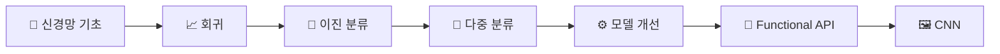
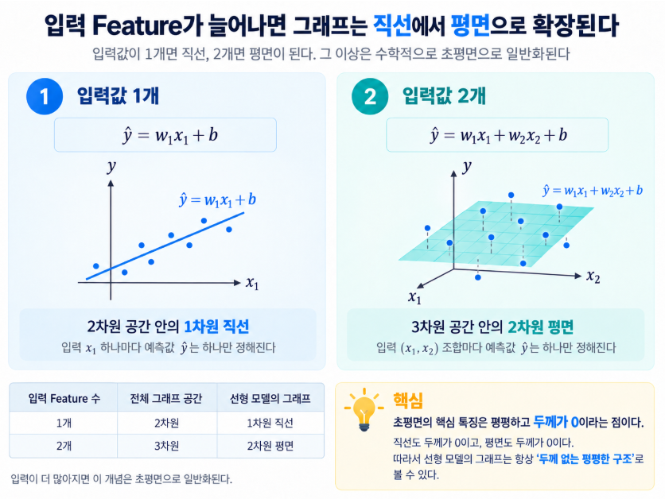

<div align="center">

# 📘 Furiosa TensorFlow · Keras Study

### TensorFlow / Keras 기반 딥러닝 학습 기록

수업에서 배운 개념을 **직접 코드로 구현하고**,
이해한 내용을 **필기 · 실습 · 시각화 · 기술 블로그**로 정리하는 저장소입니다.

<br>

<a href="https://www.python.org/">
  
</a>
<a href="https://www.tensorflow.org/">
  
</a>


<br><br>

[**📚 Study Notes**](#-학습-필기-study-notes)
  •  
[**💻 Practice**](#-실습-구성-practice-structure)
  •  
[**🗂️ Datasets**](#️-데이터셋-datasets)
  •  
[**✍️ Velog**](https://velog.io/@wordi/series/AI-%EC%97%94%EC%A7%80%EB%8B%88%EC%96%B4%EB%A7%81-%ED%95%99%EC%8A%B5%EB%85%B8%ED%8A%B8)

</div>

---

## 📌 개요 (Overview)

**Furiosa AI Agent 과정**에서 학습한 TensorFlow / Keras 내용을 정리한 저장소입니다.

단순히 예제 코드를 보관하는 것이 아니라,

* 수업에서 학습한 개념을 다시 정리하고
* 직접 모델을 구현하고
* 모델의 동작 원리를 시각적으로 이해하고
* 실험 결과와 생각을 기록하는 것

을 목표로 하고 있습니다.

### 🎯 주요 학습 범위

| 구분            | 학습 내용                                                               |
| ------------- | ------------------------------------------------------------------- |
| 🧠 **신경망 기초** | Dense Layer · Weight · Bias · Forward Propagation · Backpropagation |
| 📈 **문제 유형**  | Regression · Binary Classification · Multi-class Classification     |
| 🧹 **데이터 처리** | Train / Validation / Test Split · Scaling · Input Shape             |
| ⚙️ **모델 학습**  | Loss Function · Optimizer · Batch · Epoch                           |
| 📊 **평가**     | R² · RMSE · Accuracy · ROC-AUC                                      |
| 🛡️ **일반화**   | Overfitting · EarlyStopping · Dropout                               |
| 💾 **모델 관리**  | Save / Load · Weight Save / Load · ModelCheckpoint                  |
| 🏗️ **모델 구조** | Sequential API · Functional API · CNN                               |

---

## 🧭 학습 흐름 (Learning Roadmap)



```text
신경망의 기본 원리
        ↓
회귀 문제
        ↓
이진 / 다중 분류
        ↓
Validation · Scaling · EarlyStopping
        ↓
Dropout · Functional API
        ↓
CNN · Image Classification
```

---

# 📚 학습 필기 (Study Notes)

> 각 일차별로 수업 내용, 코드, 직접 공부한 내용과 추가 실험을 정리합니다.

|   Day  | 학습 내용                                                                                                                                                                                                                                                                                                                                   |
| :----: | --------------------------------------------------------------------------------------------------------------------------------------------------------------------------------------------------------------------------------------------------------------------------------------------------------------------------------------- |
| **01** | **🧠 신경망 기초**<br>개발 환경 · Batch · 신경망 · 가중치와 편향 · 역전파 · Loss<br><br>📘 [1일차 필기 보기](./keras/1일차%20필기.md)                                                                                                                                                                                                                                  |
| **02** | **🔢 텐서와 행렬**<br>스칼라 · 벡터 · 행렬 · 텐서 · 행렬곱 · Shape · Sequential Model<br><br>📘 [2일차 필기 보기](./keras/2일차%20필기.md)                                                                                                                                                                                                                         |
| **03** | **✂️ 데이터 분리와 MSE**<br>Train / Test Split · `train_test_split` · Mean Squared Error<br><br>📘 [3일차 필기 보기](./keras/3일차%20필기.md)                                                                                                                                                                                                           |
| **04** | **📈 회귀와 분류**<br>데이터의 중요성 · Regression · Classification · 데이터 전처리<br><br>📘 [4일차 필기 보기](./keras/4일차%20필기.md)<br>✍️ [MSE · RMSE · RMSLE · R²의 관계](https://velog.io/@wordi/MSE-RMSE-RMSLE-R2%EC%9D%98-%EA%B4%80%EA%B3%84)                                                                                                                 |
| **05** | **🧩 Dense와 ReLU**<br>Dense Layer · Hidden Layer · Output Layer · ReLU · 초평면<br><br>📘 [5일차 필기 보기](./keras/5일차%20필기-%20ReLU.md)<br>✍️ [초평면 · 뉴런 · ReLU · 순전파와 역전파](https://velog.io/@wordi/%EA%B7%80-%EC%B4%88%ED%8F%89%EB%A9%B4-%EB%89%B4%EB%9F%B0-ReLU-%EC%88%9C%EC%A0%84%ED%8C%8C%EC%99%80-%EC%97%AD%EC%A0%84%ED%8C%8C)              |
| **06** | **📊 Validation과 EarlyStopping**<br>Validation · 과적합 · History 시각화 · EarlyStopping<br><br>📘 [6일차 필기 보기](./keras/6일차%20필기.md)                                                                                                                                                                                                           |
| **07** | **🎯 과적합과 이진 분류**<br>학습 시간 측정 · 과적합 방지 · Binary Classification · BCE<br><br>📘 [7일차 필기 보기](./keras/7일차%20필기.md)<br>✍️ [이진 분류에서 MSE vs Cross Entropy](https://velog.io/@wordi/%EB%B6%84%EB%A5%98-%EB%AA%A8%EB%8D%B8%EC%97%90%EC%84%9C-loss-%ED%95%A8%EC%88%98-%EC%84%B1%EB%8A%A5-%EB%B9%84%EA%B5%90-Mean-Squared-Error-VS-Cross-Entropy) |
| **08** | **🔀 문제 유형 비교**<br>Regression · Binary Classification · Multi-class Classification 비교<br><br>📘 [8일차 필기 보기](./keras/8일차%20필기.md)                                                                                                                                                                                                        |
| **09** | **🎨 다중 분류와 ROC-AUC**<br>Softmax · One-Hot Encoding · Argmax · ROC-AUC · Input Shape<br><br>📘 [9일차 필기 보기](./keras/9일차%20필기.md)                                                                                                                                                                                                         |
| **10** | **⚖️ Scaling과 모델 저장**<br>MinMax · Standard · MaxAbs · Robust Scaler · 이상치 · 모델 저장<br><br>📘 [10일차 필기 보기](./keras/10일차%20필기.md)                                                                                                                                                                                                          |
| **11** | **🌿 Functional API와 Dropout**<br>Sequential · Functional Model · Dropout · Branch · Ensemble<br><br>📘 [11일차 필기 보기](./keras/11일차%20필기.md)<br>✍️ [Dropout을 아주 쉽게 이해하기](https://velog.io/@wordi/Dropout%EC%9D%84-%EC%95%84%EC%A3%BC-%EC%89%BD%EA%B2%8C-%EC%9D%B4%ED%95%98%EA%B8%B0)                                                      |

---

# 🖼️ 학습 내용 예시 (Visual Note)

## 입력 Feature 수와 초평면

뉴런 하나의 기본 계산식은 다음과 같습니다.

```text
ŷ = w₁x₁ + w₂x₂ + ... + wₙxₙ + b
```

입력 Feature의 개수에 따라 모델은 서로 다른 차원의 초평면을 만들게 됩니다.

```text
Feature 1개 → 2차원 공간의 직선

Feature 2개 → 3차원 공간의 평면

Feature N개 → N+1 차원의 초평면
```

<p align="center">
  <a href="https://velog.io/@wordi/%EA%B7%80-%EC%B4%88%ED%8F%89%EB%A9%B4-%EB%89%B4%EB%9F%B0-ReLU-%EC%88%9C%EC%A0%84%ED%8C%8C%EC%99%80-%EC%97%AD%EC%A0%84%ED%8C%8C">
    
  </a>
</p>

<p align="center">
  <sub>
    ChatGPT를 활용해 제작한 학습용 이미지 · 내용 구성 및 검수: 작성자
  </sub>
</p>

<div align="center">

📖 **[초평면 · 뉴런 · ReLU · 순전파와 역전파 자세히 보기](https://velog.io/@wordi/%EA%B7%80-%EC%B4%88%ED%8F%89%EB%A9%B4-%EB%89%B4%EB%9F%B0-ReLU-%EC%88%9C%EC%A0%84%ED%8C%8C%EC%99%80-%EC%97%AD%EC%A0%84%ED%8C%8C)**

</div>

---

# 💻 실습 구성 (Practice Structure)

코드 파일은 **학습 순서에 따라 번호를 붙여 관리**합니다.

파일 번호만 보더라도 어느 시점에 어떤 개념을 공부했는지 확인할 수 있도록 구성했습니다.

| 파일                              | 주요 내용                                            |
| ------------------------------- | ------------------------------------------------ |
| `keras01.py` ~ `keras08_*.py`   | Keras 기초 · Dense · Batch · 행렬 · 다중 입력 / 출력       |
| `keras09_*.py` ~ `keras20_*.py` | 데이터 분리 · 회귀 · 평가 지표 · Validation · EarlyStopping |
| `keras21_*.py` ~ `keras28_*.py` | 이진 분류 · 다중 분류 · Input Shape · Scaling            |
| `keras29_*.py` ~ `keras32_*.py` | 모델 저장 / 불러오기 · Weight · ModelCheckpoint          |
| `keras33_*.py`                  | Dropout                                          |
| `keras34_*.py`                  | Functional API                                   |
| `keras35_*.py`                  | GPU 실행 테스트                                       |
| `keras36_*.py`                  | CNN · MNIST                                      |

### 📁 Repository Structure

```text
furiosa-tensorflow-keras/
│
├── keras/
│   ├── 1일차 필기.md
│   ├── 2일차 필기.md
│   ├── ...
│   ├── 11일차 필기.md
│   │
│   ├── keras01.py
│   ├── keras02_*.py
│   ├── ...
│   └── keras36_*.py
│
├── images/
│   └── hyperplane-feature.png
│
├── _data/
│   └── ...
│
└── README.md
```

> `_data/` 내부의 일부 Kaggle / Dacon 데이터는 저장소에 포함하지 않습니다.

---

# 🗂️ 데이터셋 (Datasets)

다양한 문제 유형을 직접 비교하기 위해 여러 공개 데이터셋을 사용합니다.

| 문제 유형                             | 데이터셋                                                                             |
| --------------------------------- | -------------------------------------------------------------------------------- |
| 📈 **Regression**                 | California Housing · Diabetes · Boston Housing · Dacon 따릉이 · Kaggle Bike Sharing |
| 🎯 **Binary Classification**      | Breast Cancer Wisconsin · Santander Customer Transaction                         |
| 🎨 **Multi-class Classification** | Iris · Wine · Covertype · Digits · MNIST                                         |

> **Dacon / Kaggle 실습 데이터는 저장소에 포함되어 있지 않습니다.**
>
> 코드를 실행하려면 각 Python 파일에서 사용하는 `./_data/...` 경로에 데이터를 별도로 준비해야 합니다.

---

# ⚙️ 개발 환경 (Environment)

### Core


### Installation

```bash
pip install tensorflow numpy pandas scikit-learn matplotlib
```

일부 실습 코드는 로컬 데이터셋 또는 저장된 모델 경로를 사용합니다.

```python
path = "./_data/..."
```

실행하기 전에 각 파일의 `path` 값을 현재 개발 환경에 맞게 수정해야 합니다.

---

# ✍️ 관련 글 (Related Writing)

수업에서 배운 내용을 단순히 기록하는 데 그치지 않고,
직접 이해한 방식으로 다시 설명한 글을 Velog에 작성하고 있습니다.

### 📚 Series

**[AI 엔지니어링 학습노트 전체 보기 →](https://velog.io/@wordi/series/AI-%EC%97%94%EC%A7%94%EC%A7%80%EB%8B%88%EC%96%B4%EB%A7%81-%ED%95%99%EC%8A%B5%EB%85%B8%ED%8A%B8)**

### 📖 Posts

* [MSE · RMSE · RMSLE · R²의 관계](https://velog.io/@wordi/MSE-RMSE-RMSLE-R2%EC%9D%98-%EA%B4%80%EA%B3%84)
* [초평면 · 뉴런 · ReLU · 순전파와 역전파](https://velog.io/@wordi/%EA%B7%80-%EC%B4%88%ED%8F%89%EB%A9%B4-%EB%89%B4%EB%9F%B0-ReLU-%EC%88%9C%EC%A0%84%ED%8C%8C%EC%99%80-%EC%97%AD%EC%A0%84%ED%8C%8C)
* [분류 모델에서 Loss 함수 성능 비교 — MSE vs Cross Entropy](https://velog.io/@wordi/%EB%B6%84%EB%A5%98-%EB%AA%A8%EB%8D%B8%EC%97%90%EC%84%9C-loss-%ED%95%A8%EC%88%98-%EC%84%B1%EB%8A%A5-%EB%B9%84%EA%B5%90-Mean-Squared-Error-VS-Cross-Entropy)
* [Dropout을 아주 쉽게 이해하기](https://velog.io/@wordi/Dropout%EC%9D%84-%EC%95%84%EC%A3%BC-%EC%89%BD%EA%B2%8C-%EC%9D%B4%ED%95%98%EA%B8%B0)
* [딥러닝을 공부하며 깨달은 프롬프트 엔지니어링의 본질](https://velog.io/@wordi/%EB%94%A5%EB%9F%AC%EB%8B%9D%EC%9D%84-%EA%B3%B5%EB%B6%80%ED%95%98%EB%A9%B0-%EA%B9%A8%EB%8B%AC%EC%9D%80-%ED%94%84%EB%A1%AC%ED%94%84%ED%8A%B8-%EC%97%94%EC%A7%80%EB%8B%88%EC%96%B4%EB%A7%81%EC%9D%98-%EB%B3%B8%EC%A7%88)

---

<div align="center">

### 🚀 Learn · Implement · Visualize · Record

**개념을 이해하고 → 직접 구현하고 → 실험하고 → 기록합니다.**

<br>


</div>
